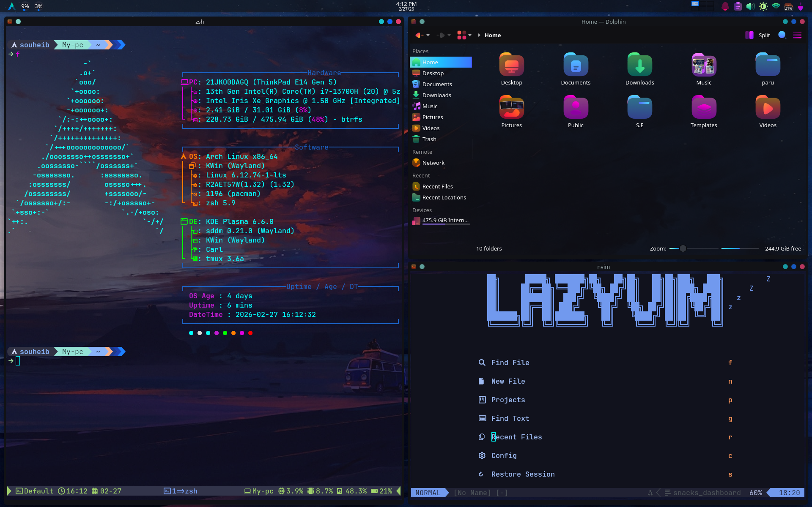

# 🍚 My Arch Rice

> My personal dotfiles for Arch Linux

## 🛠️ Stack

| Tool | Name |
|------|------|
| OS | Arch Linux |
| DE | KDE Plasma |
| Terminal | Kitty |
| Shell | Zsh + Starship |
| Editor | Neovim (LazyVim) |
| Multiplexer | Tmux |
| Monitor | Btop |



## 📦 Installation
```bash
git clone --bare https://github.com/Souheib-h/My-arch-rice.git $HOME/.dotfiles
alias dotfiles='/usr/bin/git --git-dir=$HOME/.dotfiles/ --work-tree=$HOME'
dotfiles checkout
dotfiles config --local status.showUntrackedFiles no
```

## 🔌 Tmux Plugins
Plugins are managed via [tpm](https://github.com/tmux-plugins/tpm). After installing, press `prefix + I` to install.

## 🙏 Credits

Inspired by / configs adapted from:
- [DT (DistroTube)](https://www.youtube.com/@DistroTube) — aliases
- [henrymisc](https://www.youtube.com/@henrymisc) — zsh plugins & tmux theming


## 🖼️ Wallpapers

Wallpapers sourced from:
- [omarchy](https://github.com/basecamp/omarchy) — by DHH
- [DistroTube](https://www.youtube.com/@DistroTube)
- [HyDE](https://github.com/HyDE-Project/Hyde-gallery)
- [WallpaperFlare](https://www.wallpaperflare.com)
